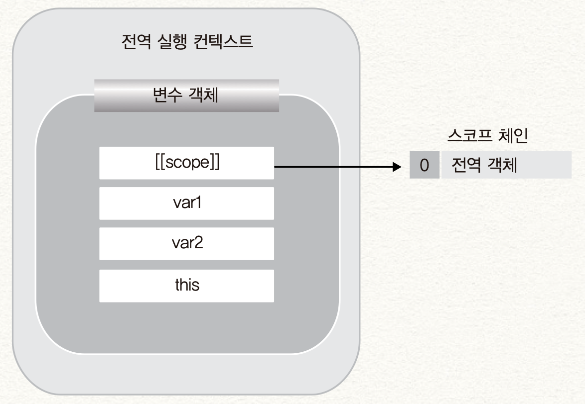
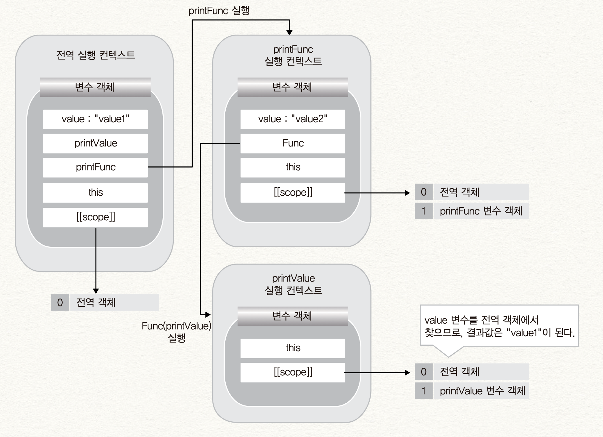
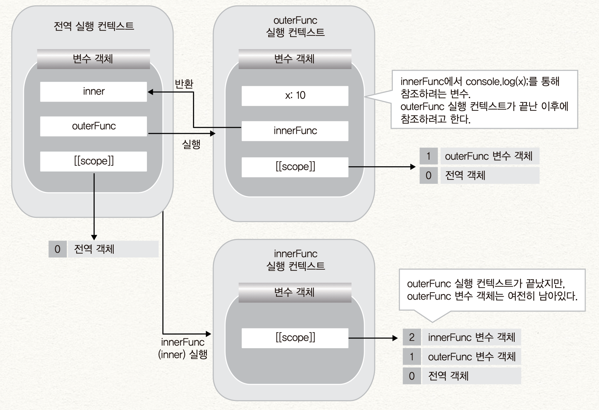

# 실행 컨텍스트와 클로저

> 이 글은 고현준, 송형주 님의 [인사이드 자바스크립트](https://g.co/kgs/K6Laug)를 참조하여 작성한 글입니다.

## 실행 컨텍스트 개념

다른 언어의 콜 스택(call stack) 개념과 유사한 개념

> 콜 스택(call stack) : 함수를 호출할 때 해당 함수의 호출 정보(함수 내 지역 변수 혹은 인자값 등)가 쌓여있는 스택

ECMAScript에서는 실행 컨텍스트를 **"실행 가능한 코드를 형상화하고 구분하는 추상적인 개념"** 으로 기술하고, 이를 콜 스택과 연관지어 정의하면 **"실행 가능한 자바스크립트 코드 블록이 실행되는 환경"** 이라고 할 수 있다.

여기서 말하는 코드 블록은 대부분의 경우 함수이다.

ECMAScript에서는 실행 컨텍스트가 형성되는 경우를 세 가지로 규정한다.

- 전역 코드
- `eval()` 함수로 실행되는 코드
- 함수 안의 코드를 실행할 경우

대부분 함수로 실행 컨텍스트를 만드는데, 이 코드 블록 안에 변수 및 객체, 실행 가능한 코드가 들어있다. 이 코드가 실행되면 실행 컨텍스트가 생성되고, 실행 컨텍스트가 스택 안에 하나씩 차곡차곡 쌓이며 실행된다.

ECMAScript에서는 실행 컨텍스트의 생성을 다음처럼 설명한다.

**"현재 실행되는 컨텍스트에서 이 컨텍스트와 관련 없는 실행 코드가 실행되면, 새로운 컨텍스트가 생성되어 스택에 들어가고 제어권이 그 컨텍스트로 이동한다."**

```javascript
var x = "xxx";

function foo() {
  var y = "yyy";

  function bar() {
    var z = "zzz";
    console.log(x + y + z);
  }
  bar();
}
foo();
```

위 코드를 실행하면 아래와 같이 실행 컨텍스트 스택(Stack)이 생성하고 소멸한다.

현재 실행 중인 컨텍스트에서 이 컨텍스트와 관련없는 코드(다른 함수 등)가 실행되면 새로운 컨텍스트가 생성되고 스택에 쌓이고 제어권이 이동한다.


> 예제 및 그림 출처 : [실행 컨텍스트와 자바스크립트의 동작 원리 - Poiemaweb](https://poiemaweb.com/js-execution-context)

1. 컨트롤이 실행 가능한 코드로 이동하면, 논리적 스택 구조를 가지는 새로운 실행 컨텍스트 스택이 생성된다. 스택은 LIFO(Last In First Out, 후입 선출)의 구조를 가지는 나열 구조이다.
2. 전역 코드(Global code)로 컨트롤이 진입하면, 전역 실행 컨텍스트가 생성되고 실행 컨텍스트 스택에 쌓인다. 전역 실행 컨텍스트는 애플리케이션이 종료될 때(웹 페이지에서 나가거나 브라우저를 닫을 때)까지 유지된다.
3. 함수를 호출하면 해당 함수의 실행 컨텍스트가 생성되며 직전에 실행된 코드 블록의 실행 컨텍스트 위에 쌓인다.
4. 함수 실행이 끝나면 해당 함수의 실행 컨텍스트를 파기하고 직전의 실행 컨텍스트에 컨트롤을 반환한다.

## 실행 컨텍스트 생성 과정

자바스크립트에서 함수를 실행하면, 실행 컨텍스트가 생성된다. 실행 컨텍스트가 생성된 이후에 자바스크립트 엔진은 다음의 일을 순서대로 실행한다.

- 활성 객체 생성
- `arguments` 객체 생성
- 스코프 정보 생성
- 변수 생성
- `this` 바인딩
- 코드 실행

### 활성 객체 생성

실행 컨텍스트가 생성되면 해당 **컨텍스트 실행에 필요한 정보를 담을 객체를 생성**한다. 이를 **활성 객체 또는 변수 객체** 라고 한다. 이 객체에 변수, 매개변수와 인수, 함수 선언의 정보를 담는다.

### `arguments` 객체 생성

다음으로는 `arguments` 객체를 생성한다. 앞서 만들어진 활성 객체는 `arguments` 프로퍼티로 이 `arguments` 객체를 참조한다.

### 스코프 정보 생성

다음으로는 스코프 정보를 생성한다. 스코프 정보는 현재 컨텍스트의 유효 범위를 나타낸다. 이는 현재 실행 중인 실행 컨텍스트 안에서 연결 리스트와 유사한 형식으로 만들어진다. 이 리스트로 현재 컨텍스트부터 상위 실행 컨텍스트의 변수까지 접근 가능하다.

자세한 과정은 스코프 체이닝에서 살펴본다.

### 변수 생성

다음으로 현재 실행 컨텍스트 내부에서 사용되는 지역 변수가 생성된다. 변수 객체 안에서 호출된 함수 인자는 각각의 프로퍼티가 만들어지고 그 값이 할당된다. (값이 넘겨지지 않았다면 `undefined` 가 할당된다)

변수나 내부 함수의 경우 단지 메모리에 생성하고 초기화는 각 변수나 함수에 해당하는 표현식이 실행되기 전까지는 이루어지지 않는다. (함수 선언문의 경우 함수 호이스팅이 일어나 함수 객체를 즉시 할당한다.)

### `this` 바인딩

마지막 단계에서는 `this` 키워드를 사용하는 값이 할당된다. 이 값에 어떤 객체가 들어갈지는 [함수호출과 `this` 바인딩](https://www.notion.so/younho9/4-2-3b392de0b7854a1593e3aabf63ce73ec#8e12b9ea90ae44fca633a5c8687c2b3a)에서 살펴봤으니 참조하자.

### 코드 실행

이렇게 하나의 실행 컨텍스트가 생성되고 변수 객체가 만들어진 후에 코드에 있는 표현식이 실행된다.

## 스코프 체인

자바스크립트에서는 함수 내의 `{}` 블록, 즉 `for() {}` , `if() {}` 와 같은 구문은 유효 범위가 없고, 오직 함수만이 유효 범위의 한 단위가 된다. (ES6에서는 let, const를 통해 `{}` 안에 유효 범위를 갖게 만들 수 있다.)

이 유효 범위를 나타내는 스코프가 `[[scope]]` 프로퍼티로 각 함수 내에서 연결 리스트 형식으로 관리되는데, 이를 스코프 체인이라고 한다.

- **각각의 함수는 `[[scope]]` 프로퍼티로 자신이 생성된 실행 컨텍스트의 스코프 체인을 참조한다.**
- **함수가 실행되는 순간 실행 컨텍스트가 생성되고 이 실행 컨텍스트는 실행된 함수의 `[[scope]]` 프로퍼티를 기반으로 새로운 스코프 체인을 만든다.**

### 전역 실행 컨텍스트의 스코프 체인

```javascript
var var1 = 1;
var var2 = 2;
console.log(var1); // 1
console.log(var2); // 2
```

이는 전역 코드이다. 이 코드를 실행하면 전역 실행 컨텍스트가 생성되고 변수 객체가 만들어진다. 현재 전역 실행 컨텍스트 단 하나만 실행되고 있어 참조할 상위 컨텍스트가 없고 따라서 이 변수 객체의 스코프 체인은 자기 자신만을 가진다. 즉 변수 객체의 `[[scope]]` 프로퍼티는 변수 객체 자신을 가리킨다.



### 함수를 호출한 경우 생성되는 실행 컨텍스트의 스코프 체인

```javascript
var var1 = 1;
var var2 = 2;

function func() {
  var var1 = 10;
  var var2 = 20;
  console.log(var1); // 10
  console.log(var2); // 20
}

func();

console.log(var1); // 1
console.log(var2); // 2
```

이 예제를 실행하면 전역 실행 컨텍스트가 생성되고 `func()` 함수 객체가 만들어진다. 이 함수 객체의 `[[scope]]` 는 어떻게 될까? 함수 객체가 생성될 때, 그 함수 객체의 `[[scope]]` 는 현재 실행되는 컨텍스트의 변수 객체에 있는 `[[scope]]` 를 그대로 가진다. 따라서 `func` 함수 객체의 `[[scope]]` 는 전역 변수 객체가 된다.

그리고 `func()` 함수가 실행될 때, 새로운 컨텍스트( `func` 실행 컨텍스트)가 생성된다. 이 `func` 실행 컨텍스트의 스코프 체인은 실행된 함수의 `[[scope]]` 프로퍼티를 그대로 복사한 후, 현재 생성된 변수 객체를 복사한 스코프 체인의 맨 앞에 추가한다.


#### 예제 1

```javascript
var value = "value1";

function printFunc() {
  var value = "value2";

  function printValue() {
    return value;
  }

  console.log(printValue());
}

printFunc();
```

[출력 결과]

    value2


#### 예제 2

```javascript
var value = "value1";

function printValue() {
  return value;
}

function printFunc(func) {
  var value = "value2";
  console.log(func());
}

printFunc(printValue);
```

[출력 결과]

    value1



> 위 두 예제는 렉시컬 스코핑(Lexical scoping)을 이해하는데 중요한 예제이다. - [🔗 함수의 범위(scope) - ZeroCho](https://www.zerocho.com/category/Javascript/post/5740531574288ebc5f2ba97e)

## 클로저

### 클로저의 개념

```javascript
function outerFunc() {
  var x = 10;
  var innerFunc = function () {
    console.log(x);
  };
  return innerFunc;
}

var inner = outerFunc();
inner(); // 10
```



예제에서 `innerFunc()` 는 `outerFunc()` 의 실행이 끝난 후 실행된다. `outerFunc()` 의 실행 컨텍스트가 사라진 이후에 `innerFunc` 실행 컨텍스트가 생성되는 것이다. 그러면 `innerFunc()` 의 스코프 체인은 `outerFunc` 변수 객체를 참조할 수 있을까?

이것을 가능하게 하는 것이 **클로저(Closure)** 라는 개념이다. `outerFunc` 의 실행 컨텍스트가 사라지더라도 `outerFunc` 변수 객체는 여전히 남아있다.

여기서 최종 반환되는 함수 `innerFunc` 가 외부 함수 `outerFunc` 의 지역변수 `x` 에 접근하고 있다는 것이 중요하다. 이 지역 변수에 접근하려면, 함수가 종료되어 실행 컨텍스트가 반환되더라도, 변수 객체는 반환되는 내부 함수의 스코프 체인에 그대로 남아있어야만 접근할 수 있다.

이처럼 **이미 생명 주기가 끝난 외부 함수의 변수를 참조하는 함수를 클로저**라고 한다. 따라서 `innerFunc()` 를 클로저라고 하고, **클로저로 참조되는 외부 변수 `x` 를 자유 변수** 라고 한다.

## 참고자료

[🔗 함수의 범위(scope) - ZeroCho](https://www.zerocho.com/category/Javascript/post/5740531574288ebc5f2ba97e)

[🔗 실행 컨텍스트와 자바스크립트의 동작 원리 - Poiemaweb](https://poiemaweb.com/js-execution-context)
