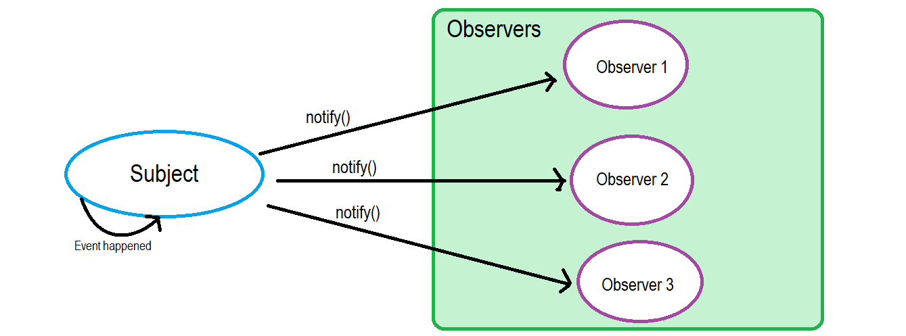
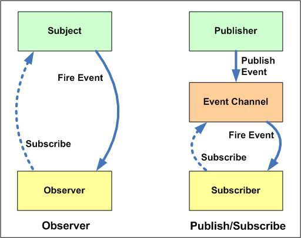

[Observer vs Pub-Sub Pattern](https://medium.com/better-programming/observer-vs-pub-sub-pattern-50d3b27f838c)

## 옵저버 패턴

## Pub-Sub 패턴

## 차이점

- Observer 패턴에서 Observer는 Subject를 알고 있고, Subject는 Observer에 대한 기록을 유지한다. 반면 Pub-Sub 패턴에서 Publisher와 Subscriber는 서로를 알 필요가 없다. 단순히 메시지 버스나, 브로커의 도움으로 통신한다.

- Observer 패턴보다 Pub-Sub 패턴이 서로 느슨하게 결합되어 있다.

- Observer 패턴은 대부분 동기적으로 구현된다. (이벤트가 발생할 때 관찰자의 메소드를 실행) Pub-Sub 패턴은 대부분 비동기적으로 구현된다. (메시지 큐를 사용)
